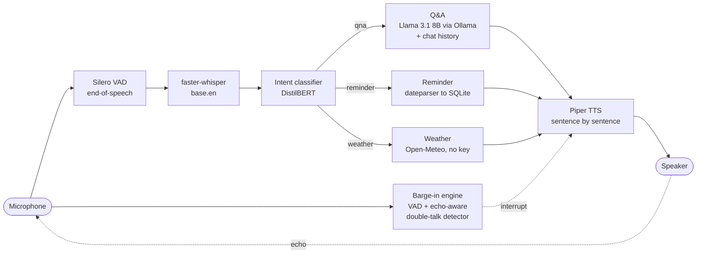

# Voice Productivity Assistant

A real-time, voice-driven assistant that runs **entirely on a laptop with no paid services**.
You talk to it; it routes what you said to one of three skills — general Q&A, reminders, or
weather — and answers out loud. You can **interrupt it mid-sentence** and it stops, listens, and
handles what you said instead.

Built and measured on an Apple M4 Pro (24 GB). Everything below marked *measured* was
observed on that machine; where something is not finished or not verified, it says so.

> **Status:** working end to end by voice (verified live on real hardware). Replies are now
> streamed sentence by sentence (`voice_pipeline_v5`); that pipeline is verified with typed
> input and real audio output, and its live spoken barge-in is not yet re-verified (the previous
> non-streaming `v4` was verified live for interrupting a Q&A answer and for interrupting while
> thinking). The reminder-then-weather interruption and rapid double interruptions are not yet
> verified live. The demo GIF is not recorded yet (see [docs/DEMO_SCRIPT.md](docs/DEMO_SCRIPT.md)).

## Architecture



One duplex audio stream carries both the microphone and the speaker, so the barge-in engine sees
exactly what is being played and can tell the assistant's own voice apart from yours.

| Stage | Choice | Notes |
|---|---|---|
| Turn-taking | Silero VAD | Waits ~0.7 s of silence after you stop |
| STT | faster-whisper `base.en`, CPU int8 | |
| Router | DistilBERT fine-tuned on 3 intents | See accuracy below |
| Q&A | Llama 3.1 8B via Ollama | Streamed and spoken sentence by sentence; kept resident (`keep_alive`); last 4 exchanges as context |
| Reminders | `dateparser` + SQLite | Stores task and due time locally |
| Weather | Open-Meteo geocoding + forecast | No API key |
| TTS | Piper `en_US-lessac-medium` | Each sentence is synthesized while the previous one plays |
| Orchestration | **Hand-written** (threads + one duplex stream) | Pipecat was in the original plan and is **not used**; see Lessons |

## Intent classifier

Trained on synthetic phrases: an LLM (Groq free tier) generated ~220 varied spoken phrasings per
intent, plus 20 greeting-style phrases added after a live failure. 680 examples total, 578 train /
102 held out.

**Held-out accuracy: 100% (102/102)**, precision and recall 1.00 for all three intents.

Read that number with suspicion. Synthetic phrases for different intents are far more distinct
from each other than real speech, so this is an optimistic ceiling, not a claim about real-world
accuracy. The more informative results are the edge cases: it correctly sends "what's a good
reminder app" to Q&A despite the word "reminder", and its confidence drops on genuinely
ambiguous input ("should I bring an umbrella today" scored 0.74–0.78). It also failed on "hey
what's up" (routed to weather at 0.97) until greetings were added to the training data.

## Latency

Per-stage median milliseconds, 4 phrases per intent, speech synthesized with macOS `say`, first
TTS sentence only (script: `scripts/benchmark_latency.py`, log: `logs/latency.jsonl`):

| Intent | STT | Classify | Handler | TTS (1st sentence) | Total |
|---|---:|---:|---:|---:|---:|
| Q&A | 425 | 32 | 1733 | 231 | **2421** |
| Reminder | 471 | 27 | 4 | 151 | **653** |
| Weather | 401 | 26 | 1475 | 124 | **2025** |

Reminders are fastest, as expected: no LLM, no network (about 4 ms in the handler). **Weather is
about as slow as Q&A**, which contradicts the assumption that skipping the LLM makes a path fast: it
makes two sequential network calls (geocode, then forecast), roughly 1.5 s. In the first run weather
was slower than Q&A; in this one it is slightly faster. The reminder-versus-the-rest gap is the
robust result, the weather-versus-Q&A ordering is within noise.

**Streaming the reply.** The table's Q&A row is for a short answer generated in full. For longer
answers the pipeline now streams: the LLM's tokens are cut into sentences as they arrive and
each is synthesized and spoken while the model is still writing the next. Measured on a 4-sentence
answer (machine under load, so absolute times are inflated, the ratio is the point): speech could
start after **26.4 s** non-streamed versus **6.3 s** streamed (4.2x sooner), and time-to-first-word
now depends on the first sentence, not the whole answer.

Caveats: excludes the fixed ~0.7 s end-of-speech wait and audio playback time; n=4 per intent;
Q&A answers were short and the LLM is not streamed, so a longer answer takes proportionally
longer before speech starts. **Measured with no other heavy job running** (Ollama at
27.9 tokens/s, 27% memory free). An earlier run gave 1730 / 515 / 2001 ms totals, so treat roughly
±30% as run-to-run noise at n=4. For contrast, a concurrent GPU fine-tuning job cut Q&A generation
to ~5 tokens/s, and a cold LLM start added ~6 s (now avoided by loading the model at startup).
The Q&A row is a short answer generated in full; the streamed pipeline starts speaking sooner (below).

## Barge-in

The hardest part, and where most of the engineering went. Talking over the assistant is easy for
a human and surprisingly hard for a laptop with no echo cancellation.

**What it does:** while the assistant is thinking or speaking (including the gaps while it waits
for the LLM's next sentence), it keeps listening. If you start talking, playback stops within a
fraction of a second, the LLM request is **cancelled**, only what you actually heard is
remembered, and the sentence you just said is already captured and handled next.

**How it works:**

- One duplex audio stream drives mic and speaker together; the audio callback does only cheap
  array copies, and VAD inference runs on a separate thread.
- The assistant's own voice reaches the mic and scores VAD probability ≈ 1.0, so VAD alone can
  never distinguish you from it. A Geigel-style double-talk detector compares mic energy to the
  energy being played, learns the echo level on the fly, and only triggers when you are clearly
  louder than the echo, for about 0.2 s.
- After an interruption the speaker goes silent but the stream keeps running until you finish
  your sentence.

**Measured on this machine:** echo delay ~130 ms, echo-to-playback level ratio ~0.12–0.16.
Tuned offline against recorded real echo plus injected clicks plus simulated user speech
(`scripts/record_echo_takes.py`, `scripts/tune_barge_in.py`): 0 false triggers on 10 echo-only
cases, 25 of 30 simulated interruptions caught, median delay ~360 ms. Live with nobody speaking,
the assistant cut itself off in 1 of 10 messages.

## Known limitations

- **No acoustic echo cancellation.** With speakers, roughly 1 in 10 messages may be cut off by
  the assistant's own voice or a click. A quiet voice (below ~1.5× the echo level) is not detected,
  and the first ~0.8 s of each message is deaf while the echo level is estimated. Headphones remove
  the echo entirely and should make it reliable; real AEC (e.g. WebRTC) is the proper fix and was out
  of scope for a free, pure-Python stack.
- **The classifier's 100% is optimistic** (synthetic data, see above).
- **Location extraction is a regex** (capitalised words after in/for/at/near/of). Whisper can
  mis-hear unusual place names ("Dhanbad" came out as "Danabad", "Danbhad", …), and geocoding then
  fails.
- **Memory is per session and shallow:** last four exchanges for Q&A, the last weather city, and a
  "which city?" follow-up. It is lost on restart, and reminders/weather do not use chat history.
- **Reminder time parsing has limits.** A bare hour is assumed ("at 6" → 6 PM, "at 8" → 8 AM) and a
  date with no time defaults to 9 AM; the assistant says when it assumed. "Next Monday" is
  ambiguous when today is Sunday.
- **Sentence-level streaming has seams.** The LLM can be slower than speech, leaving a pause between
  sentences; a sentence is only spoken once its end is unambiguous (a period followed by a lowercase
  word, like "5 p.m. yesterday", is not treated as an end), which costs about one token of delay.
- Tested only on macOS / Apple Silicon.

## Cost: $0, no payment method anywhere

| Component | What | Cost |
|---|---|---|
| Speech-to-text | faster-whisper (open source, local) | $0 |
| Voice activity | Silero VAD (open source, local) | $0 |
| Intent classifier | DistilBERT fine-tune (local) | $0 |
| Q&A LLM | Llama 3.1 8B via Ollama (local) | $0 |
| Text-to-speech | Piper (open source, local) | $0 |
| Weather | Open-Meteo (no key, no signup) | $0 |
| Reminders | SQLite (local file) | $0 |
| Training-data generation | Groq free tier, email signup, no card; used **once** to write phrases, never at run time | $0 |

## Run it

```bash
python3 -m venv venv && source venv/bin/activate
pip install -r requirements.txt

# Ollama (https://ollama.com), then:
ollama pull llama3.1:8b
python -m piper.download_voices --download-dir models/tts en_US-lessac-medium

# Classifier: the training data is committed, so just train (~40 s on Apple Silicon)
python src/classifier/train.py
# Optional: regenerate the data. Needs a free Groq key in .env (GROQ_API_KEY=...)
# python src/classifier/generate_dataset.py

python scripts/demo_preflight.py                      # checks everything below
python src/orchestration/voice_pipeline_v5.py         # the full assistant (streaming replies)
```

`VAD_DEBUG=1` prints the barge-in detector's live numbers. Earlier stages are kept as separate
scripts (`voice_pipeline_v1` fixed-window STT → `v2` VAD turn-taking → `v3` TTS → `v4` barge-in +
memory → `v5` streamed replies) so each step can be run and compared.

## Lessons learned

- **Test with the real input path early.** The reminder parser passed every typed test and then
  broke on real transcripts: Whisper writes "6 p.m." with periods, and `dateparser` silently
  substitutes the *current clock time* when it cannot read "at 6" or "in the evening". Fixing that
  meant announcing only times the user actually said, and saying so when a default was used.
- **Fixed-length recording is a trap.** A 5-second window cut sentences mid-word and made Whisper
  hallucinate text from silence; VAD turn-taking fixed both.
- **Two audio streams on one device is not a duplex design.** The first barge-in attempt opened a
  separate mic stream and speaker stream and produced crackling and a native crash. One duplex stream
  with a cheap callback and inference on another thread fixed it.
- **Read the library's actual contract.** Barge-in could never fire because Silero's
  `VADIterator` emits a single `start` event, not one per frame, and my code counted consecutive
  ones. The debug log made it obvious; guessing would not have.
- **Tune against recordings, not guesses.** Hand-tuning the detector against one failure at a time
  kept causing the next. Recording real echo from the machine and grid-searching offline (with clicks
  and simulated users injected) found settings that held up, and revealed that sentence boundaries
  needed more caution than continuous speech.
- **A discarded request is not free.** Measured: after abandoning a long non-streamed answer, the
  next question took 57 s (Ollama was still finishing the old one) versus 1.1 s when the streamed
  request was cancelled. Barge-in has to cancel work, not just ignore it.
- **Measure before assuming.** "Skipping the LLM makes weather fast" was wrong. And an 18-second
  first answer turned out to be a cold model load plus a background training job, not the code.
- **Hand-rolling the pipeline instead of using Pipecat** gave full control over the duplex stream and
  the barge-in logic, and taught how the pieces interact, but costs more code and more bugs than a
  framework's built-in interruption handling would. A fair trade for learning; probably not the
  right one for a product.
